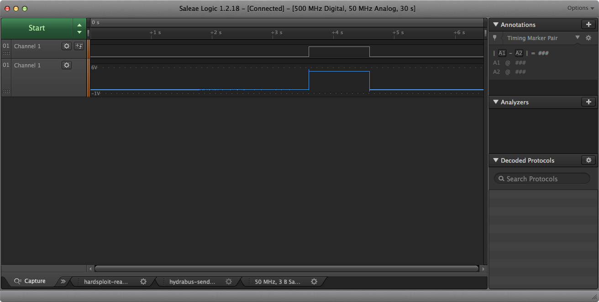
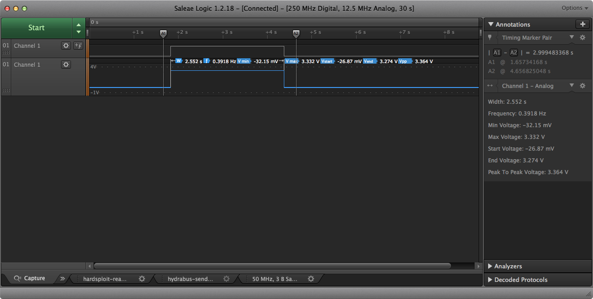

# Output Voltage of Hardware tools

## Arduino 

The arduino will produce a peak of 5v. This might not be ideal for all setups. 

	
Example Code used to produce the above peak. 

	const int outPIN = 10;
	
	void setup() {
	
	pinMode(outPIN, OUTPUT);
	
	
	digitalWrite(outPIN, HIGH);
	// pause application for 1 second
	delay(1000);
	digitalWrite(outPIN, LOW);
	
	}
	
	void loop() {
	//empty
	}

## HYDRABUS

Hydrabus has GPIO functionality and it works with various voltage. 
	
I used PA8 pin and measured the state and outputting voltage. It provided a peak of 3.3v
	
	> gpio pa8 mode out off 
	Clearing PA8 
	> gpio pa8 mode out on  
	Setting PA8 
	> gpio pa8 mode out off 
	Clearing PA8 

